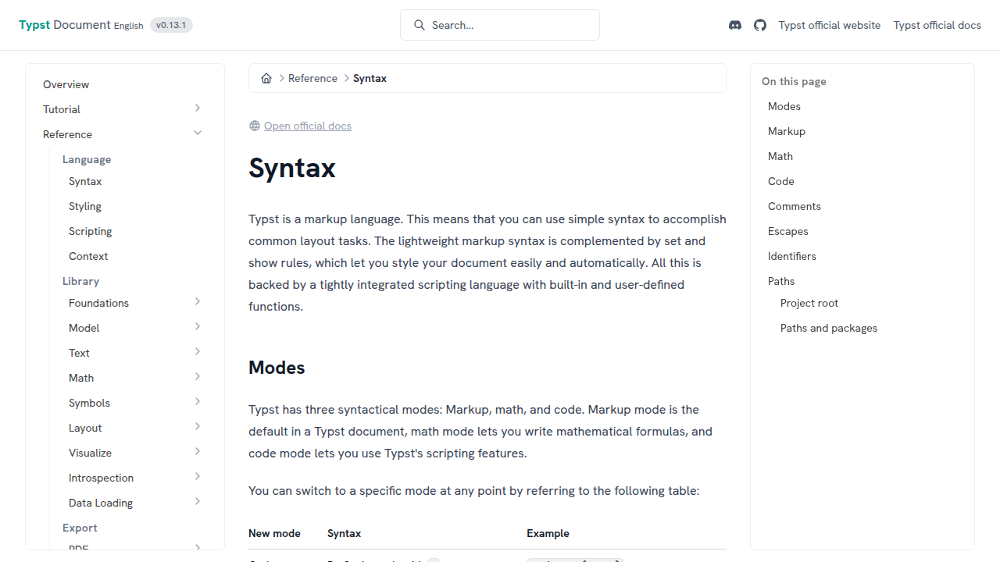

# typst-docs-web

<div align="center">
  
</div>

Build a website from the documentation JSON file generated by [typst-docs](https://github.com/typst/typst/blob/main/docs/Cargo.toml#L2).

## Required toolchains

- [Node.js](https://nodejs.org/)
- [Bun](https://bun.sh/)

Using [mise](https://mise.jdx.dev/) is recommended, as it enables central management of all the toolchains required for both the SSG and the upstream typst-docs.

```toml
# mise.toml
[tools]
rust = "1.83.0" # set required version for typst-docs
node = "22.11.0"
bun = "1.2.21"
```

## Setup

> [!NOTE]
> The JSON structure generated by typst-docs is not stable and may change at any time. This project is confirmed to be compatible with typst-docs [v0.13.1](https://github.com/typst/typst/tree/v0.13.1). Other versions are usually compatible as well, but they have not been tested carefully.

The typst-docs CLI outputs the static files required for building the documentation. Place the JSON file and assets generated by typst-docs in the `/public/` directory. In most use cases, symbolic links are convenient.

```sh
# Run in the root directory of typst/typst repository
cargo run --package typst-docs -- --assets-dir assets --out-file docs.json --base /docs/
```

```plaintext
public
├── assets ⇒ /path/to/typst/assets
└── docs.json ⇒ /path/to/typst/docs.json
```

Create `/public/metadata.json` and describe the metadata for the documentation website. For details on each property, refer to the JSON schema. For example:

```json
{
  "$schema": "../metadata.schema.json",
  "language": "ja-JP",
  "version": "0.13.1",
  "typstOfficialUrl": "https://typst.app",
  "typstOfficialDocsUrl": "https://typst.app/docs/",
  "githubOrganizationUrl": "https://github.com/typst-jp",
  "githubRepositoryUrl": "https://github.com/typst-jp/docs",
  "discordServerUrl": "https://discord.gg/9xF7k4aAuH",
  "originUrl": "https://typst-jp.github.io/",
  "basePath": "/docs/",
  "displayTranslationStatus": true
}
```

`/public/translation-status.json` is used to manage the translation progress and the classification of original content. This file is automatically updated when running the SSG, so manual editing is not necessary.

The image provided in `public/favicon.png` is used as the favicon for the documentation website. Currently, this image is also used as the OGP `og:image`, so please provide it in PNG format.

## Commands

After installing dependencies with Bun, the following commands are available:

```sh
bun install --frozen-lockfile
```

### Develop

> [!NOTE]
> The full-text search index is generated by [pagefind](https://pagefind.app/), but since the output directory is set to `/dist/`, full-text search functionality is currently unavailable in the development server. For developing search-related features, please execute `bun run build` first, then use `bun run preview` to inspect the built output.

```sh
bun run dev
```

### Build

```sh
bun run build
```

### Preview

```sh
bun run preview
```

### Check

```sh
# Check code style
bun run check

# Apply automatic code fixes
bun run check:write
```

### Test

```sh
bun run test
```

## Maintainers

- [@3w36zj6](https://github.com/3w36zj6)

## License

This project is derived from [typst/typst](https://github.com/typst/typst) and is licensed under the Apache-2.0 license.

Non-OSS assets distributed by the Typst web app are not included in this project.
